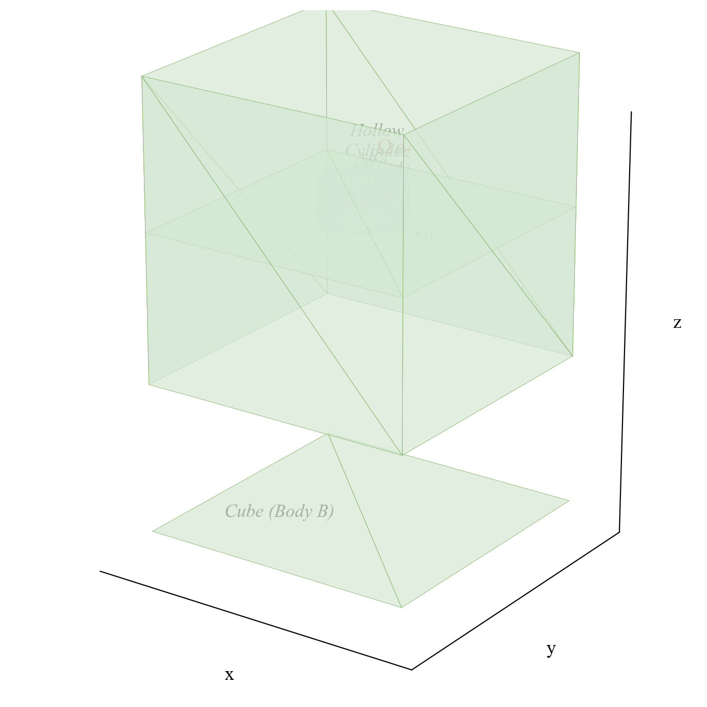
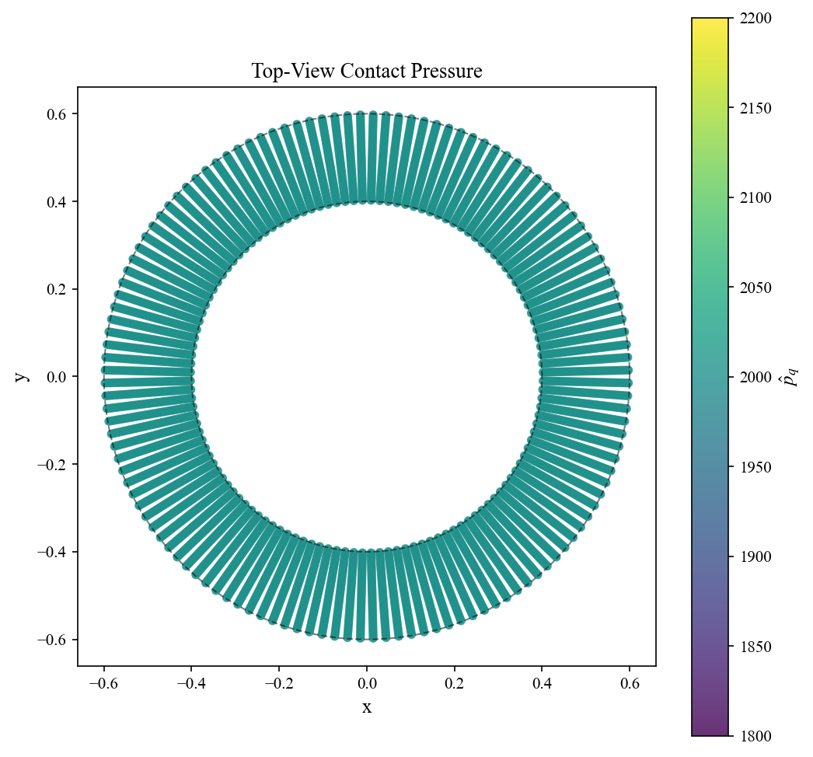
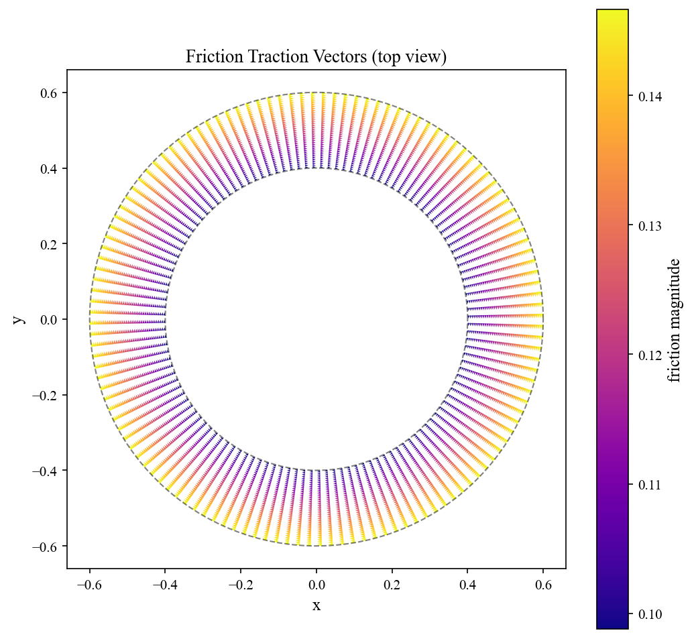
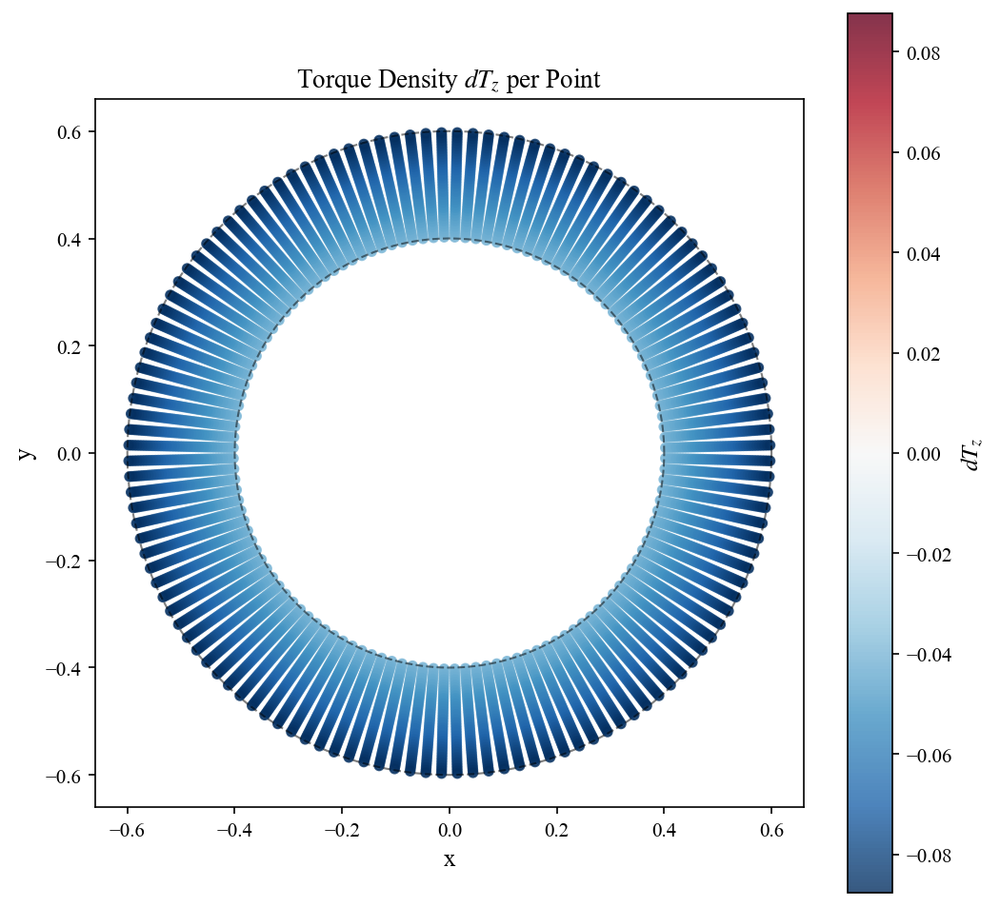
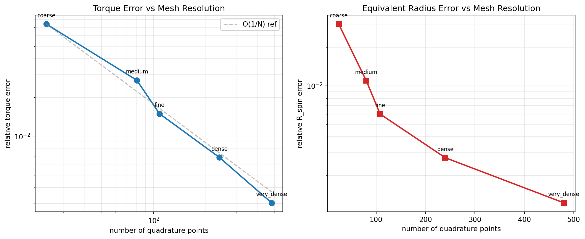

# sdf-contact-module

A standalone C++ plugin for building, storing, and querying **Signed Distance Fields (SDF)** from triangle meshes. Designed for contact mechanics in rigid-body simulation.

<div align="center">

</div>

## Features

- **SDF construction** from OBJ meshes with configurable resolution and padding
- **Five query modes**: FirstOrder, SecondOrder, Trilinear, Tricubic, ContactAware
- **Dense and sparse** narrow-band storage
- **Binary `.sdf` format** with magic `"SDFO"` (version 0.1.0)
- **OpenMP** parallel acceleration (optional CUDA support)
- **Eigen3** header-only dependency — fully standalone (no NexDyn core required)

## Validation: Torsional Friction on Annular Contact

A Python theory prototype validates that **trilinear SDF + per-point friction integration** produces the correct non-zero torsional friction torque on a symmetric annular contact patch — a result that is lost when forces are averaged over the patch.

<div align="center">
<table>
<tr>
  <td></td>
  <td></td>
  <td></td>
</tr>
<tr>
  <td align="center"><b>Annular contact patch</b><br/>Uniform pressure on ring</td>
  <td align="center"><b>Friction traction vectors</b><br/>Azimuthal direction → pure torque</td>
  <td align="center"><b>Torque density</b><br/>Same-sign everywhere → non-zero total</td>
</tr>
</table>
</div>

**Key result**: Although the net tangential force integrates to zero (perfect symmetry), the torsional friction torque is non-zero and converges to the analytic solution:

| Metric | Value | Target |
|--------|-------|--------|
| Relative torque error | **3.3e-05** (0.0033%) | < 0.1% |
| Tangential force residual | **2.0e-17** (≈ 0) | symmetry verified |

<div align="center">

</div>

## Repository Structure

```
sdf-contact-module/
├── plugins/SdfOracle/       # Core plugin source
│   ├── include/SdfOracle/   # Public headers
│   ├── src/                 # Implementation
│   └── app/                 # SdfOracleDemo executable
├── prototype/               # Python contact integration prototype
├── models/                  # 3D mesh files (OBJ)
├── wiki/                    # Project documentation
└── docs/                    # Design notes
```

## Build

### Dependencies

| Dependency | Required | Notes |
|------------|----------|-------|
| CMake ≥ 3.15 | Yes | |
| C++17 compiler | Yes | MSVC, GCC, Clang |
| Eigen3 | Yes | Header-only linear algebra |
| OpenMP | No | Default ON (`NEXDYN_SDF_ENABLE_OPENMP`) |
| CUDA | No | Default OFF (`NEXDYN_SDF_ENABLE_CUDA`) |

### Quick Start

```bash
cmake -B build -S plugins/SdfOracle
cmake --build build
```

### Options

```bash
cmake -B build -S plugins/SdfOracle \
    -DNEXDYN_SDF_ENABLE_OPENMP=ON \
    -DNEXDYN_SDF_ENABLE_CUDA=OFF
```

### Targets

| Target | Type | Description |
|--------|------|-------------|
| `SdfOracleCore` | Static lib | Runtime query + I/O |
| `SdfOracle` | Static lib | Core + Builder |
| `SdfOracleDemo` | Executable | Validation & benchmarking |

## Usage

### Build SDF from OBJ

```bash
./SdfOracleDemo --obj <mesh.obj> --resolution <res> --out <prefix>
```

### Query Modes

| Mode | Description |
|------|-------------|
| `FirstOrder` | Taylor expansion at nearest voxel center |
| `SecondOrder` | + Hessian term for improved accuracy |
| `Trilinear` | Trilinear interpolation of phi0 from 8 surrounding voxels |
| `Tricubic` | Hermite cubic for C1 continuity |
| `ContactAware` | Multiple surface-feature candidates per voxel |

### `.sdf` Binary Format

```
Header (128 bytes):
  magic    = "SDFO"       (4 bytes)
  version  = 100          (0.1.0)
  nx, ny, nz              (grid dimensions)
  bmin, bmax              (bounding box, 6 × double)
  voxel                   (voxel size, 3 × double)
  flags                   (hasHessian, sparseBlocks, contactAwareCandidates)

Payload (dense):
  phi0[N], n0[N×3], H0[N×6], witness0[N×3]
```

## Documentation

See the [wiki/](wiki/index.md) for architecture, API reference, algorithms, build workflows, and validation details.

## License

See [LICENSE](LICENSE).
